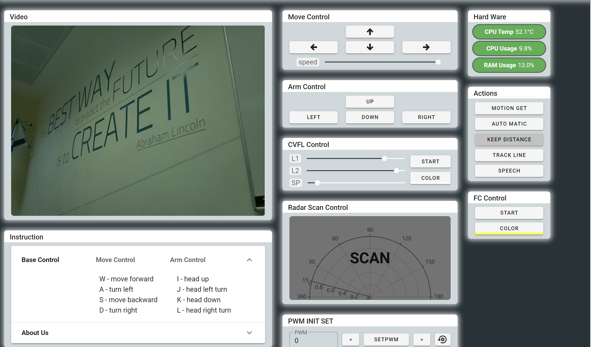
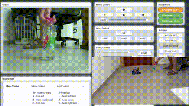
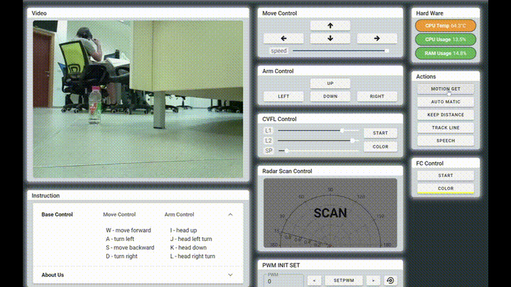

# CarSmartAI

This repository contains the code for an autonomous robot vehicle designed to follow lines, avoid obstacles, and navigate its environment intelligently using various sensors and actuators. The project is structured to be modular, making it easy to extend and maintain.

## Table of Contents
- [CarSmartAI](#carsmartai)
  - [Table of Contents](#table-of-contents)
  - [Introduction](#introduction)
  - [Features](#features)
  - [Example](#example)
    - [webApp](#webapp)
    - [Distance Keeping](#distance-keeping)
    - [Find color](#find-color)
    - [Motion get](#motion-get)
    - [Automatic](#automatic)
  - [Hardware Requirements](#hardware-requirements)
  - [Software Requirements](#software-requirements)
  - [Installation](#installation)
    - [`setup.py` Script](#setuppy-script)
  - [Usage](#usage)
  - [Code Structure](#code-structure)
  - [Classes and Methods](#classes-and-methods)
    - [`Functions` Class](#functions-class)
  - [Settings Configuration](#settings-configuration)
  - [Contributing](#contributing)
  - [License](#license)

## Introduction
The autonomous robot vehicle is designed to demonstrate the capabilities of modern robotics in terms of navigation and obstacle avoidance. It utilizes a combination of motor control, servo control, ultrasonic sensors, and LED indicators to move around its environment, detect and avoid obstacles, and follow predefined lines.


## Features
- **Line Following**: Uses infrared sensors to detect and follow lines on the ground.
- **Camera Tracking**: Utilizes a camera to follow visual markers or paths.
- **Obstacle Avoidance**: Employs ultrasonic sensors to detect obstacles and navigate around them.
- **Dynamic Speed Control**: Adjusts speed based on proximity to obstacles.
- **Speech Recognition**: Processes voice commands to control the robot.
- **LED Indicators**: Uses RGB LEDs to indicate the robot's status and actions.
- **Automatic Mode**: Combines various sensors and actuators for autonomous navigation.
- **Distance Keeping**: Maintains a safe distance from obstacles.

## Example
### webApp

### Distance Keeping

### Find color

### Motion get

### Automatic


## Hardware Requirements
- Raspberry Pi (any model with GPIO pins)
- Motor driver (e.g., L298N)
- Servo motors (e.g., SG90)
- Ultrasonic sensor (e.g., HC-SR04)
- Infrared sensors for line detection
- Camera module (e.g., Raspberry Pi Camera)
- Microphone (for speech recognition)
- RGB LEDs
- Adafruit PCA9685 PWM Driver
- Power supply (battery pack)
- Connecting wires and a breadboard

## Software Requirements
- Python 3.x
- Libraries specified in `requirements.txt`

## Installation
1. Clone the repository:
    ```bash
    git clone https://github.com/bsharabi/CarSmartAI.git
    cd CarSmartAI
    ```

2. Install the required Python packages:
    ```bash
    sudo pip3 install -r requirements.txt
    ```

3. Run the setup script to install additional dependencies and configure the Raspberry Pi:
    ```bash
    sudo python3 setup.py install
    ```

### `setup.py` Script
The `setup.py` script automates the installation of additional dependencies and configurations needed for the Raspberry Pi. It includes steps to install system packages, Python libraries, and set up necessary services. Ensure you run this script with root privileges (`sudo`) to allow it to configure the system properly.

## Usage
1. Ensure all hardware components are properly connected:
    - Follow the pin configuration as defined in the `settings.py` file.

2. Run the main script:
    ```bash
    sudo python3 __main__.py
    ```

3. Stop the program:
    - Press `Ctrl+C` to stop the program safely.

## Code Structure
- `__main__.py`: Entry point for the robot's control program.
- `README.md`: Project documentation.
- `requirements.txt`: List of required Python libraries.
- `robot/`: Directory containing core modules for robot control.
  - `motor.py`: Module for motor control.
  - `sensor.py`: Module for sensor data processing.
  - `servo.py`: Module for servo control.
  - `led.py`: Module for LED status indication.
  - `functions.py`: Contains the `Functions` class for various robot actions.
- `settings.py`: Configuration settings for various components.
- `setup.py`: Setup script for installing dependencies and configuring the Raspberry Pi.
- `webApp/`: Directory containing the web server for remote control and monitoring.

## Classes and Methods

### `Functions` Class
The `Functions` class in `functions.py` contains various methods to control the robot's behavior:

- `__init__(self, *args, **kwargs)`: Initializes the class and sets up GPIO pins.
- `radarScan(self)`: Initiates a radar scan using the servo controller.
- `pause(self)`: Pauses the robot's current function.
- `resume(self)`: Resumes the robot's paused function.
- `automatic(self)`: Sets the robot to automatic mode.
- `trackLine(self)`: Sets the robot to track lines on the ground using infrared sensors.
- `trackLineWithCamera(self)`: Sets the robot to track lines or markers using a camera.
- `keepDistance(self)`: Sets the robot to maintain a distance from obstacles.
- `steady(self, goalPos)`: Sets the robot to maintain a steady position based on a goal.
- `speech(self)`: Sets the robot to process speech recognition commands.
- `trackLineProcessing(self)`: Processes the line tracking logic using infrared sensors.
- `trackLineCameraProcessing(self)`: Processes the line tracking logic using the camera.
- `automaticProcessing(self)`: Processes the automatic navigation logic.
- `steadyProcessing(self)`: Processes the logic to maintain a steady position.
- `keepDisProcessing(self)`: Processes the logic to maintain a safe distance from obstacles.
- `speechProcessing(self)`: Processes speech recognition commands.
- `functionGoing(self)`: Determines which function to execute based on the current mode.
- `run(self)`: Main loop that continuously checks and executes the current function.

## Settings Configuration
The `settings.py` file contains various configuration options for the robot, including motor settings, servo settings, and line-following parameters. Adjust these settings according to your hardware setup and preferences.

## Contributing
Please fork this repository and submit pull requests for any improvements or bug fixes.

## License
This project is licensed under the MIT License. See the LICENSE file for details.